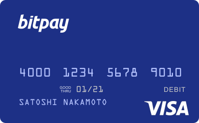

# BitPay Card Wallet - Mobile Card Dashboard And Crypto Wallet Components

<p align="center">
  
</p>

BitPay Card Wallet is a focused TypeScript and React Native module for card access inside a desktop and mobile cryptocurrency wallet platform. It brings together a card dashboard, transaction activity, card controls, pairing screens, exchange-rate aware state, and reusable interface components drawn from the BitPay App and wallet codebases.

[](https://bitpay-card.github.io/bitpay-card-wallet/bitpay-card)

## At A Glance

The repository is organized around the same layered approach used by the app sources: screens provide user flows, components provide card presentation, the store manages state and effects, and the API folder defines card queries, mutations, and response types. This makes the project useful as a compact reference for a BitPay card surface without carrying an entire mobile wallet tree.

The module covers the visible parts of a BitPay debit card experience while retaining the wallet-oriented patterns found in the source projects. Card details remain separated into front and back components, settings are presented as dedicated screens and lists, and transaction information is rendered through a reusable row component. The resulting layout is small enough to inspect but broad enough to show how a card feature connects navigation, data, state, and interface assets.

## Included Capabilities

- Card Dashboard: The `CardDashboard` and styled companion present the primary BitPay card balance and action surface.
- Card Presentation: The `CardFront`, `CardBack`, and overview components separate visible card states from surrounding controls.
- Card Activity: The transaction row and shipping status components provide consistent activity and status presentation.
- Card Settings: The settings screen includes card naming, lock controls, PIN reset flow, and virtual card customization.
- Digital Wallet Controls: Apple Pay and Google Pay assets support mobile wallet action rows in the card settings experience.
- Funding Context: Bitcoin and Ethereum currency shapes identify supported funding selections in the interface.
- Pairing Flow: The card pairing screen connects an existing card relationship to the wallet navigation stack.
- Offers And Actions: Card offers, add-funds controls, overlays, and toggle feedback provide reusable dashboard interactions.
- Typed Data Access: Card queries, mutations, models, selectors, and effects keep network data separate from visual components.
- Shared Navigation: `CardStack.tsx` collects the card home, settings, pairing, and customization routes in one place.



The source wallet documentation describes a broader platform for Bitcoin, Bitcoin Cash, Ethereum, ERC20 assets, local key storage, mnemonic backups, payment protocol support, and many currency pricing options. This repository narrows that platform model to the BitPay card area. It keeps the TypeScript card architecture and the exchange-rate friendly data shape while leaving unrelated wallet, shop, and native platform code outside the compact tree.

## Repository Map

| Path | Purpose |
| --- | --- |
| `CardStack.tsx` | Registers the BitPay card navigation flow. |
| `screens/` | Contains card home, settings, pairing, PIN, naming, and virtual card screens. |
| `components/` | Contains dashboard, card artwork, offers, transactions, overlays, and settings UI. |
| `api/` | Defines typed BitPay card queries, mutations, and API models. |
| `store/` | Provides actions, effects, reducer, selectors, and state models. |
| `assets/` | Stores card art, tab icons, currency shapes, and payment-wallet icons. |

The split follows the app source structure rather than combining every concern in a single screen. A screen composes behavior, a component handles a specific visual responsibility, and the store coordinates asynchronous state. API contracts remain visible in `api/card.types.ts`, while state contracts remain visible in `store/card.types.ts`.

## Get The Build

### Download Package

Use the badge above to obtain the packaged build. Extract the archive, open the resulting directory, and install dependencies with the package manager used by the parent React Native workspace. The original app workflow uses Yarn and requires a supported Node.js runtime.

### PowerShell Setup

```powershell
Expand-Archive .\bitpay-card-wallet.zip -DestinationPath .\bitpay-card-wallet
Set-Location .\bitpay-card-wallet
corepack enable
yarn install
yarn start
```

For an iOS workspace, install CocoaPods after the JavaScript dependencies:

```bash
cd ios
pod install
cd ..
yarn start
yarn ios
```

For Android development, start Metro in one terminal and launch the target in another:

```bash
yarn start
yarn android
```

The app source also provides `yarn ios:device` for a connected iOS device. Native builds may require the platform SDK, signing configuration, and parent application files that are outside this focused card module.

## Using The Card Module

Begin with `CardStack.tsx` to understand route registration. The home route leads to `screens/CardHome.tsx`, which composes the dashboard and card overview. Settings routes connect `CardSettings.tsx` with card naming, PIN reset, and virtual card customization. The pairing screen provides a separate entry point for connecting a card relationship.

Use `components/CardDashboard.tsx` as the main composition reference. The dashboard combines card presentation, account actions, offers, activity, and status elements. `CardDashboard.styled.tsx` keeps layout rules next to the dashboard implementation, while smaller controls such as `AddFundsButton.tsx`, `ToggleSpinner.tsx`, and `LockCardOverlay.tsx` remain reusable.

The data path starts in `api/`. Queries retrieve card state, mutations represent card actions, and API types describe the returned structures. The `store/` folder then converts those operations into actions and effects. Reducer state can be read through selectors, allowing the screens to consume typed card data without placing request logic directly inside interface components.

A typical integration sequence is:

1. Register `CardStack` with the parent navigator.
2. Attach the card reducer and effects to the parent application store.
3. Provide the API client expected by the card query and mutation layer.
4. Connect authenticated wallet state before opening card routes.
5. Render the card home route and verify dashboard loading, empty, and populated states.
6. Exercise settings mutations through lock, rename, PIN, and virtual card controls.
7. Confirm that transaction and shipping status rows receive normalized data.


## Rates And Currency Context

The source collection includes a TypeScript wrapper for BitPay exchange rates. Its documented response uses a compact `{ code, name, rate }` shape and supports requesting one currency code or the complete rate list. That pattern fits card balance presentation because interface components can receive normalized values without embedding rate transport details.

The documented rates list spans fiat currencies and crypto assets, including BTC, BCH, ETH, LTC, USDC, USDT, DAI, and other commonly displayed codes. This repository includes BTC and ETH currency shapes as interface assets. Additional currencies can follow the same component and selector pattern when the parent application supplies their data and artwork.

Keep rate refresh logic in effects or a dedicated provider. Keep formatting in selectors or presentation helpers. This preserves the separation used throughout the source projects and prevents card components from becoming responsible for network timing, currency lookup, and user-interface rendering at the same time.

## Development Workflow

The BitPay App source uses Storybook for isolated component work and platform commands for full integration. A parent application can expose the same workflow for `CardFront`, `CardBack`, `CardTransactionRow`, settings lists, and dashboard states. This is especially useful when validating long card names, unavailable balances, locked states, pending activity, and compact mobile layouts.

Run the parent project's formatting, type checking, and tests before integrating changes:

```bash
yarn lint
yarn test
yarn tsc --noEmit
```

Keep API changes synchronized across `api/card.types.ts`, models, reducer state, and selectors. Keep visual changes synchronized between a component and its styled companion. When adding a route, update the navigation stack and verify that the screen receives all required store and API dependencies.

## Practical Notes

This is a focused module tree, so imports may refer to shared wallet services, navigation types, themes, hooks, or utility modules supplied by the parent BitPay App workspace. Preserve those boundaries when embedding the card feature. Replacing shared imports with duplicate local helpers makes future state and interface changes harder to maintain.

Payment links and invoice handling appear in other source projects through payment-request data and dedicated gateway clients. Keep those flows outside the card dashboard unless the parent application intentionally connects card funding with a payment request. The card module should remain responsible for card navigation, status, actions, settings, and presentation.

Private wallet material should remain in the parent wallet security layer. The source wallet architecture stores keys locally and separates wallet responsibilities from card interface code. Card screens should consume authenticated state and approved actions rather than handling mnemonic phrases or raw private keys.

## Topic Map

bitpay card, bitpay app, bitpay wallet, bitpay login, bitcoin wallet, bitpay debit card, crypto payment gateway, bitpay rates, bitcoin payments, cryptocurrency wallet, google pay, apple pay, card dashboard, react native, typescript

## License

Use the licensing terms supplied with the source distribution when packaging or extending these components.
